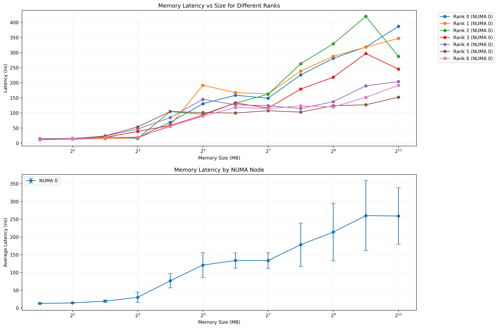
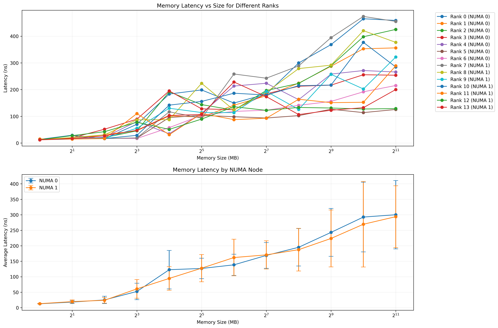

# Numa-Mem-Bench

A comprehensive NUMA performance benchmarking suite for measuring memory access latency and other performance metrics across NUMA domains.

## Overview

Numa-Mem-Bench is a high-performance tool designed to measure and analyze memory access patterns across Non-Uniform Memory Access (NUMA) domains. The benchmark provides detailed insights into memory latency using MPI for parallel execution.

For accurate NUMA benchmarking, users should control memory binding using external tools like `numactl` to ensure memory is allocated on specific NUMA nodes. We also propose a [wrapper script](./scripts/orchestrator/wrapper_numa.sh) to help users manage complex NUMA binding scenarios.

**Quick Start Commands:**

The benchmark can be used in two ways.

First, the normal usage launching the benchmark standalone with `numactl` for memory binding. 

```bash
# Example 1: Single domain (7 ranks on NUMA node 0)
srun --nodes 1 --ntasks 7 --cpu-bind=map_cpu:1,2,3,4,5,6,7 --hint=nomultithread numactl --membind=0 ./numa_mem_bench --size=1-2048 --csv=lumig_domain0_7ranks.csv
```
Then, for more complex scenarios where different ranks need different NUMA bindings, the wrapper script should be used.

```bash
# Example 2: Two domains using wrapper (14 ranks split between nodes 0 and 1)
srun --nodes 1 --ntasks 14 --cpu-bind=map_cpu:1,2,3,4,5,6,7,17,18,19,20,21,22,23 --hint=nomultithread ./scripts/orchestrator/wrapper_numa.sh --executable ./numa_mem_bench --numa=0,0,0,0,0,0,0,1,1,1,1,1,1,1 -- --size=1-2048 --csv=lumig_domain0_and_1_14_ranks.csv
```

### Workflow and Features

The tool follows a systematic approach to benchmark memory performance:

1. **Initialization**: Initializes MPI and gathers system information (NUMA nodes, CPU topology)
2. **Configuration**: Processes command-line arguments to set benchmark parameters (memory sizes, execution mode)
3. **Memory Allocation**: Allocates memory blocks of specified sizes on each NUMA node
4. **CPU & Memory Mapping**: Records the CPU and NUMA node associations of each process
5. **Latency Measurement**: Uses pointer-chasing technique to measure memory access latency
6. **Results Reporting**: Generates a formatted table of latency measurements
7. **CSV Output**: Optionally exports results to CSV format for further analysis

Features: 

- **Memory Latency Benchmark**: Measures memory access latency using the pointer-chasing technique
- **Parallel & Serial Execution**: Supports both simultaneous and serial testing modes
- **Configurable Memory Sizes**: Test with various memory sizes (single value, range, or list)
- **NUMA Topology Reporting**: Detailed mapping of processes to NUMA nodes
- **CSV Output**: Export results for further analysis
- **Numastat Integration**: View detailed NUMA statistics for processes

### Code Organization

The codebase is organized in a modular fashion to make it extensible:

```
├── src
│   ├── benchmark
│   │   ├── memory_latency_bench.c
│   │   └── memory_latency_bench.h
│   ├── common
│   │   ├── bench_common.c
│   │   └── bench_common.h
│   └── numa_mem_bench.c
│
├── scripts
│   ├── orchestrator
│   │   └── wrapper_numa.sh
│   └── visualization
│       ├── plot_scaling.py)
│       └── requirements.txt)
│
└── examples
    ├── 01_LUMIG_1_domain_7_ranks
    ├── 02_LUMIG_2_domains_14_ranks
    └── run_example.sh
```

- **src/**: Contains all source code files (`.c` and `.h`).
  - [src/benchmark](src/benchmark): Specific benchmark implementations (e.g., memory latency) with their corresponding header files.
  - [src/common](src/common/): Shared utility functions and their header files used across benchmarks.
  - [numa_mem_bench.c](./src/numa_mem_bench.c): The main application entry point and orchestrator.
- **scripts/**: Contains wrapper scripts for running benchmarks or processing results.
  - [scripts/orchestrator/](scripts/orchestrator/): Contains the [wrapper_numa.sh](./scripts/orchestrator/wrapper_numa.sh) script for managing NUMA binding.
  - [scripts/visualization/](scripts/visualization/): Contains visualization tools like [plot_scaling.py](./scripts/visualization/plot_scaling.py).

This modular design makes it easy to add new benchmarks in the future by adding files to `src/benchmark/` and updating the [Makefile](Makefile).

### Building

Requirements :
- MPI implementation (e.g., OpenMPI, MPICH)
- hwloc library (for topology detection)
- NUMA library (libnuma)
- C compiler with OpenMP support

```bash
# Using default hwloc path (~/TOOLS/hwloc)
make

# Using custom hwloc path
make HWLOC_DIR=/path/to/hwloc
```
### Benchmark Options

- `--help`, `-h`: Display help message and exit
- `--size=SIZE`: Memory size in MB (single value, range, or comma-separated list)
  - Example ranges: `--size=1-64` or `--size=128,256,512`
- `--serial`: Run in serial mode (one rank at a time)
- `--csv=FILE`: Output results to CSV file


## Standalone Usage

The benchmark is run with the Slurm workload manager using `srun`:

```bash
# Basic usage 
srun --nodes=1 --ntasks=<num_processes> ./numa_mem_bench [options]

# Example: Run with 4 processes and specific memory size
srun --nodes=1 --ntasks=4 ./numa_mem_bench --size=1024 --csv=results.csv

# Example: Run with multiple memory sizes in serial mode
srun --nodes=1 --ntasks=8 ./numa_mem_bench --size=128,256,512,1024 --serial
```

For a precise NUMA control, use system tools like `numactl` to bind processes:

```bash
# Bind all processes to NUMA node 1
srun --nodes=1 --ntasks=8 numactl --membind=1 ./numa_mem_bench --size=512
```


## [wrapper_numa.sh](scripts/orchestrator/wrapper_numa.sh) usage

To simplify running the benchmark with complex NUMA binding strategies, the [wrapper_numa.sh](./scripts/orchestrator/wrapper_numa.sh) script is provided. It handles launching the `numa_mem_bench` executable with appropriate `numactl` memory binding settings for each MPI rank based on user-provided options.

This script is designed to be launched via `srun`.

### Wrapper Command-Line Options

-   `--numa=VALUE`: Controls NUMA domain memory binding for the benchmark processes.
    -   **Single value** (e.g., `--numa=3`): Bind all ranks' memory to that NUMA node.
    -   **Comma-separated list** (e.g., `--numa=0,1,2,3`): Bind each rank's memory to the corresponding node in the list (must match the number of tasks).
    -   **`auto`**: Automatically distribute ranks across available NUMA nodes in a round-robin fashion.
    -   **Default**: If `--numa` is not specified, no explicit `numactl` binding is performed by the wrapper.
-   `--quiet`: Disable verbose output from the wrapper (default is verbose).
-   `--dry-run`: Print the `numactl` and `numa_mem_bench` commands that would be executed for each rank without actually running them. Useful for verification.
-   `--help`: Display the wrapper's help message and exit.
-   `--`: Separator. All arguments appearing after `--` are passed directly to the `numa_mem_bench` executable.

### Wrapper Examples

```bash
# Bind all ranks to NUMA node 3, pass --size=2048 to numa_mem_bench
srun --nodes=1 --ntasks=4 --cpu-bind=map_cpu:1,17,33,49 ./scripts/orchestrator/wrapper_numa.sh --numa=3 -- --size=2048

# Specify memory binding per rank (0,1,2,3), pass --size=1024 to numa_mem_bench
srun --nodes=1 --ntasks=4 --cpu-bind=map_cpu:1,17,33,49 ./scripts/orchestrator/wrapper_numa.sh --numa=0,1,2,3 -- --size=1024

# Automatic round-robin memory binding, pass --size=2048 --serial to numa_mem_bench
srun --nodes=1 --ntasks=8 ./scripts/orchestrator/wrapper_numa.sh --numa=auto -- --size=2048 --serial

# Dry run to see commands for per-rank binding
srun --nodes=1 --ntasks=4 ./scripts/orchestrator/wrapper_numa.sh --numa=0,1,2,3 --dry-run -- --size=512
```

# Examples

This section provides examples of how to run the benchmark and interpret the results.

## Example 1: Lumi-G, Numa domain 0 scaling

This example shows a basic run with 7 ranks bound to NUMA node 0. The benchmark measure multiple size between 1 and 2048 MB :

```bash
srun --nodes 1 --ntasks 7 --cpu-bind=map_cpu:1,2,3,4,5,6,7 --hint=nomultithread numactl --membind=0 ./numa_mem_bench --size=1-2048 --csv=lumig_domain0_7ranks.csv
```

### Results Table

```
 ========================================================================================================================================================
|  MPI  |        CPU     |         MEMORY    |                                               LATENCY (ns)                                                |
|-------|---------|------|-----------|-------|--------|--------|--------|--------|--------|--------|--------|--------|--------|--------|--------|--------|
| Ranks | Cores   | NUMA |  Address  | NUMA  | 1MB    | 2MB    | 4MB    | 8MB    | 16MB   | 32MB   | 64MB   | 128MB  | 256MB  | 512MB  | 1024MB | 2048MB |
|-------|---------|------|-----------|-------|--------|--------|--------|--------|--------|--------|--------|--------|--------|--------|--------|--------|
|  000  | 1       |   0  | 0x52a260  |   0   | 10.40  | 13.26  | 14.91  | 83.14  | 121.83 | 199.53 | 213.98 | 194.24 | 279.73 | 365.07 | 404.09 | 425.04 |
|  001  | 2       |   0  | 0x528bc0  |   0   | 11.64  | 13.28  | 15.23  | 14.94  | 51.10  | 93.44  | 124.43 | 177.20 | 208.69 | 258.99 | 371.88 | 231.96 |
|  002  | 3       |   0  | 0x528bc0  |   0   | 10.85  | 14.54  | 23.30  | 72.94  | 132.23 | 218.35 | 123.46 | 230.91 | 196.99 | 200.83 | 319.67 | 269.15 |
|  003  | 4       |   0  | 0x528be0  |   0   | 11.37  | 14.67  | 30.35  | 54.42  | 102.48 | 74.52  | 113.67 | 97.93  | 148.11 | 220.30 | 187.95 | 125.75 |
|  004  | 5       |   0  | 0x528cf0  |   0   | 11.25  | 13.43  | 19.52  | 61.65  | 20.23  | 194.65 | 114.59 | 164.09 | 206.77 | 180.17 | 272.75 | 325.44 |
|  005  | 6       |   0  | 0x528be0  |   0   | 10.86  | 13.61  | 23.85  | 56.28  | 107.99 | 147.41 | 101.05 | 106.95 | 124.44 | 156.39 | 151.64 | 218.10 |
|  006  | 7       |   0  | 0x528be0  |   0   | 10.93  | 13.85  | 17.06  | 45.20  | 111.21 | 139.09 | 104.98 | 153.56 | 100.52 | 118.40 | 120.21 | 165.06 |
 ========================================================================================================================================================
```

### NUMA Statistics

```
[6] ===================== NUMA Statistics =====================
[6] Last Process: Rank 6
[6] Process ID: 50212
[6] Allocated Memory Size: 2048 MB
[6] Running numastat...
[6] 
[6] Per-node process memory usage (in MBs) for PID 50212 (numa_mem_bench)
[6]                            Node 0          Node 1          Node 2          Node 3           Total
[6]                   --------------- --------------- --------------- --------------- ---------------
[6] Huge                         0.00            0.00            0.00            0.00            0.00
[6] Heap                      2050.96            0.00            0.00            0.00         2050.96
[6] Stack                        0.02            0.00            0.00            0.00            0.02
[6] Private                     10.35            0.00            5.68            0.00           16.03
[6] ----------------  --------------- --------------- --------------- --------------- ---------------
[6] Total                     2061.33            0.00            5.68            0.00         2067.01
[6]==========================================================
```

### CSV Output (log.csv)

```
size (MB),0,1,2,3,4,5,6
1,10.40,11.64,10.85,11.37,11.25,10.86,10.93
2,13.26,13.28,14.54,14.67,13.43,13.61,13.85
4,14.91,15.23,23.30,30.35,19.52,23.85,17.06
...
```
### Graphical visualization


**Visualization:**

The [plot_scaling.py](./scripts/visualization/plot_scaling.py) script can be used to generate a plot from the resulting CSV and mapping files.
The full results and mapping files for this run can be found in the `examples/01_LUMIG_1_domain_7_ranks/` directory.
```bash
python3 plot_scaling.py lumig_domain0_7ranks.csv --mapping mapping_check.log --output lumig_domain0_7ranks.png
```



*This plot shows the memory latency (ns) versus memory size (MB, log scale) for each of the 7 ranks running within NUMA domain 0. The bottom subplot shows the average latency and standard deviation for this NUMA node.*


## Example 2: Scaling on Lumi G (Multiple Domains with Wrapper)

This example demonstrates measuring memory latency scaling for 14 ranks distributed across two NUMA domains (7 ranks on Node 0, 7 ranks on Node 1) using the `wrapper_numa.sh` script for simplified NUMA binding. Ranks are bound to specific CPUs on a Lumi G compute node.

**Command:**

```bash
# 14 tasks, mapping 7 to CPUs 1-7 (Node 0) and 7 to CPUs 17-23 (Node 1 assumed)
# The wrapper binds memory: first 7 ranks to node 0, next 7 to node 1
srun --nodes 1 --ntasks 14 --cpu-bind=map_cpu:1,2,3,4,5,6,7,17,18,19,20,21,22,23 --hint=nomultithread \
./scripts/orchestrator/wrapper_numa.sh \ --executable ./numa_mem_bench \
--numa=0,0,0,0,0,0,0,1,1,1,1,1,1,1 \-- --size=1-2048 --csv=lumig_domain0_and_1_14_ranks.csv
```

*Note: This uses the wrapper's `--numa` option with a comma-separated list to assign memory binding per rank. Arguments after `--` are passed to `numa_mem_bench`.*

The full results and mapping files for this run can be found in the `examples/02_LUMIG_2_domains_14_ranks/` directory.

**Visualization:**

The [plot_scaling.py](./scripts/visualization/plot_scaling.py) script processes the CSV and mapping file to visualize the results for both NUMA domains.

```bash
python plot_scaling.py lumig_domain0_and_1_14_ranks.csv --mapping mapping_check.log --output lumig_domain0_and_1_14_ranks.png
```



*This plot shows the memory latency for ranks grouped by their NUMA node (Node 0 and Node 1). The top subplot displays individual rank performance, while the bottom subplot shows the average latency and standard deviation for each NUMA node*

---

## License

MIT License (See LICENSE file for details)

## Author

Jean Pourroy, HPE

## Extensibility

The codebase is modular and designed for extension. New benchmarks can be added by:
1. Creating new benchmark modules
2. Adding them to the Makefile
3. Integrating them with the main program
