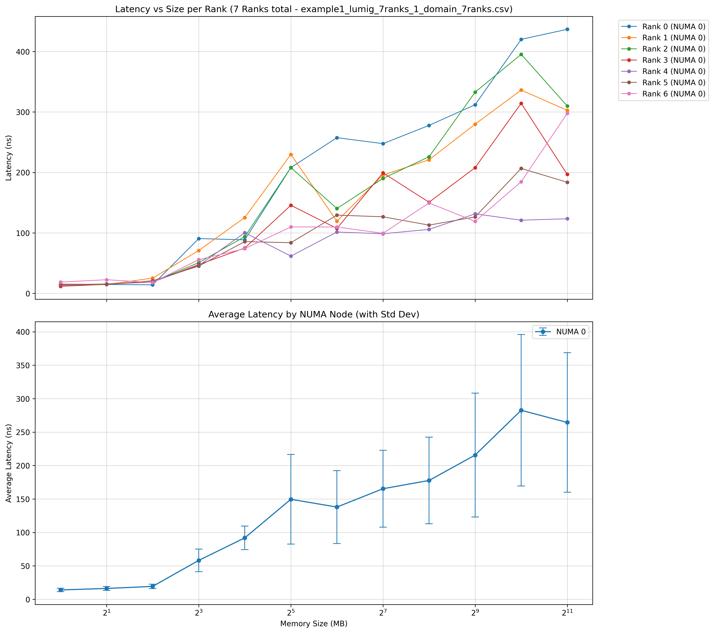
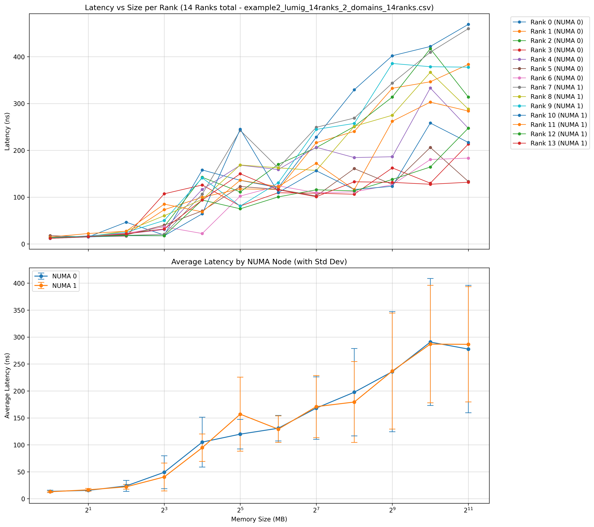
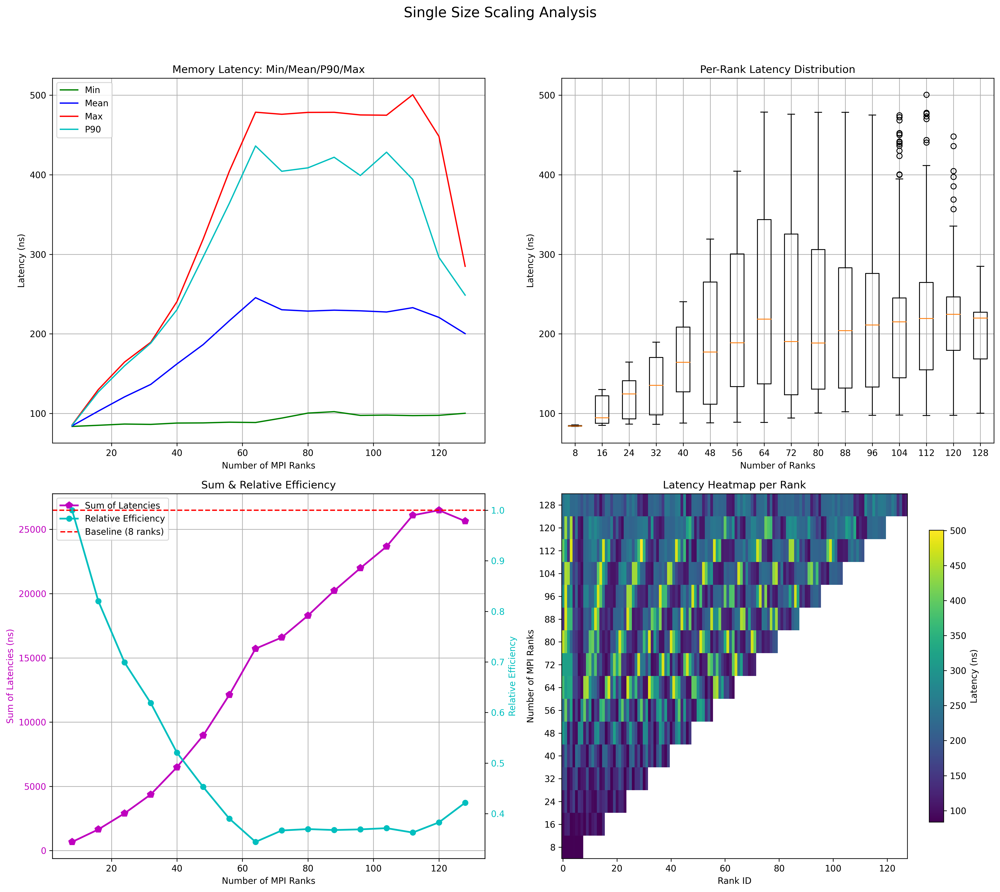
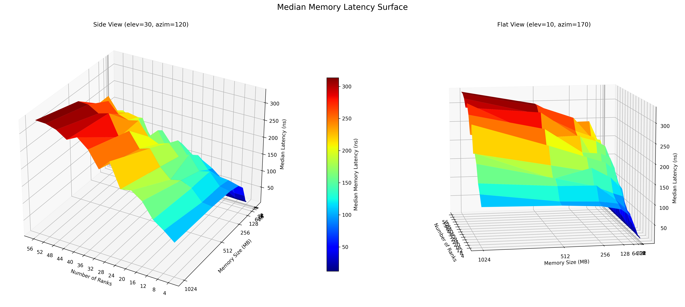

# NUMA Memory Benchmark Examples

This directory contains example benchmark scripts demonstrating various configurations of the NUMA memory benchmarking tool.

## Running the Examples

1. First, source the environment setup script:
   ```bash
   source ../env.sh
   ```

2. Run all examples:
   ```bash
   ./run_example.sh
   ```

   Or run a specific example (modify the script to call only the desired function).

## Available Examples

1. **Example 1**: Single domain test with 7 ranks on domain 0, with memory binding to domain 0.
   
   

2. **Example 2**: Dual domain test with 14 ranks on domains 0 and 1, using the wrapper script for NUMA control.

   

3. **Example 3**: Full benchmark on all cores across all domains with fixed memory size (512MB), comparing sequential and interleaved memory access patterns.

   

4. **Example 4**: Memory scaling benchmark on all cores with variable memory sizes (1-512MB or 1-1024MB), testing interleaved memory access patterns.

   

Each example creates its own directory with the benchmark results and automatically runs the visualization tool to generate analysis plots.
